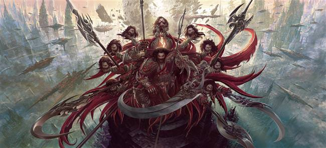

# exquisite-corpse
Write crazy stories (in markdown) with a group in a game of [exquisite corpse]

# The crazy story

Once upon a time, there was a little girl who lived in a village near the forest.  Whenever she went out, the little girl wore a *red riding cloak*, so everyone in the village called her **Little Red Riding Hood**.

One morning, **Little Red Riding Hood** asked her mother if she could go to visit her grandmother as it had been awhile since they'd seen each other.

> "That's a good idea," her mother said.  

So they packed a nice basket for **Little Red Riding Hood** to take to her grandmother.

When basket was ready, the little girl put on her red cloak and kissed mother *goodbye*.

>*"Remember, go straight to **Grandma's house**,"* Her mother cautioned.** *Don't dawdle along the way and please don't talk to strangers! The woods are dangerous"*

>*Don't worry, mommy," said **Little Red Riding Hood**, I'll be  careful."*

But when **Little Red Riding Hood** noticed some lovely flowers in the woods, she forgot her promise to her mother. She picked a few, watched the butterflies flit about for a while, listened to the frogs craoking and then picked a few more.

**Little Red Riding Hood** was enjoying the ward summer day so much, that she didn't notice a dark shadow approaching out of the forest behind her..

Suddenly, the wolf appeared beside her.

Inorder to conquer the world, Ravan asked Brahma for the gift of immortality,but Brahma said, 
>*"Death is certain, my  child!". You must die after being born into this world. So I am unable to give you the blessing of immortality. You may ask for something else!"*

Then the ambitiuos Ravan said- 
> *"O Brahma, May no god or heavenly spirit kill me. Oh Lord! may no demon, monster or beast defaet me! Give me the blessing of victory over all these!"*

Brahma also said-
> *"Tathasthu! and he disappeared.*

Blinded by his power and might, the foolish Ravan thought no mankind could harm him. Man is like a hunt for him, which can be easily trampled and defeated. His mistake was that he considered mankind weak. That is why Shri Ram was able to cut of all his 10 head and kill him ruthlessly.